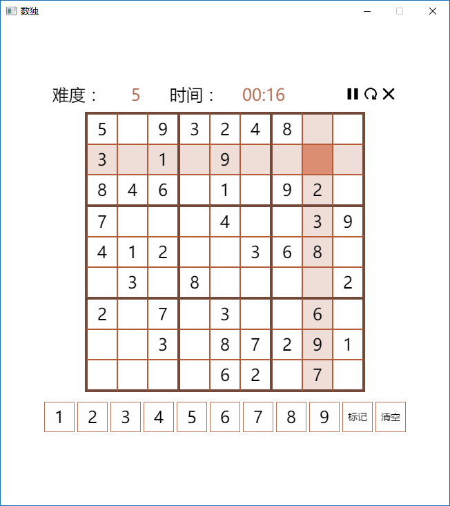
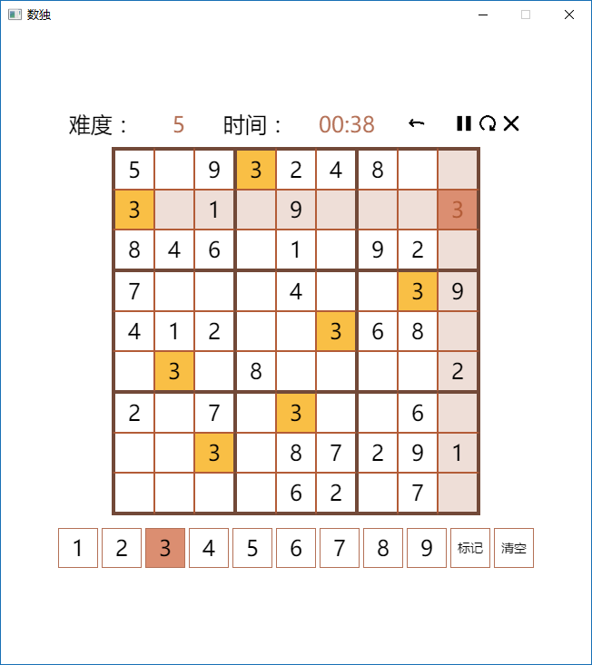
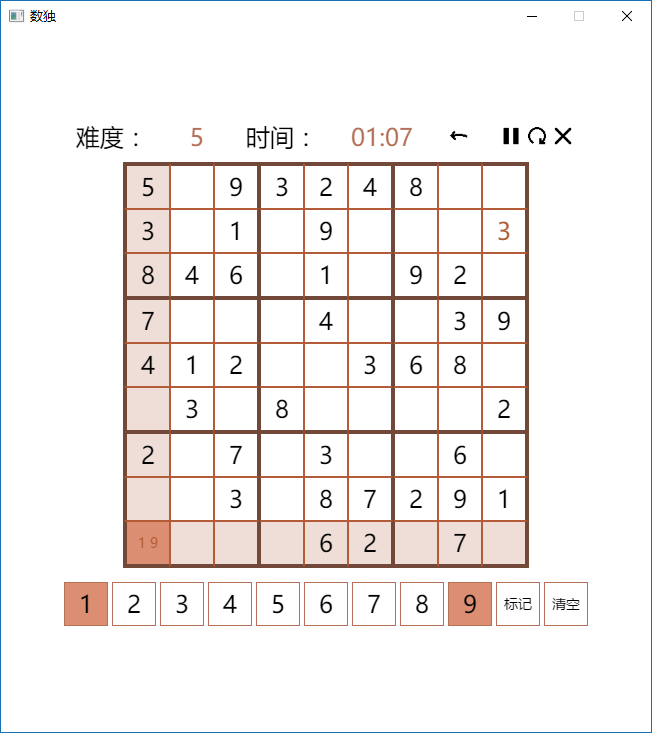
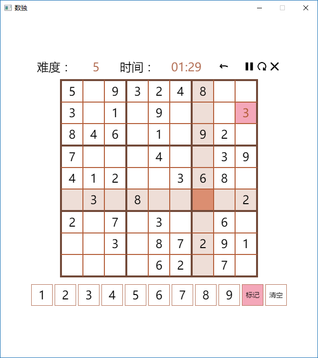
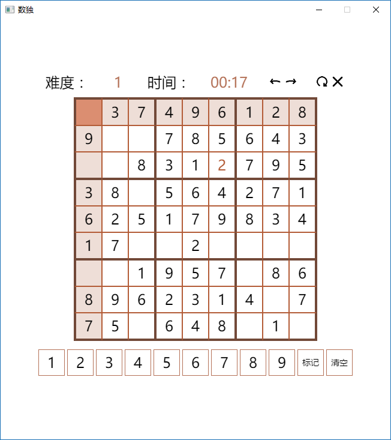
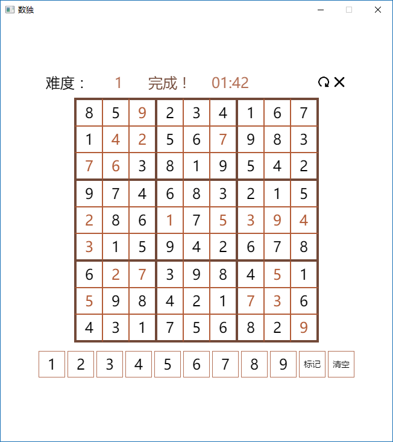

# 大作业 数独 文档

计64 苏明贤 2016011349

## 1. 实现功能

基本功能：

1. $9 \times 9$ 的棋盘，可以选定一个格子并填数，一个格子中可以填多个数字，支持一键清空一个格子；
2. 支持难度选择，提供10档难度；
3. 支持计时功能；支持暂停功能，暂停期间无法进行一切操作（重玩，退出除外）；
4. 提供一个多功能的“重玩”按钮：在有任何填数操作之后，点击“重玩”会清除所有操作，重新开始这一局；在没有任何填数操作时，点击“重玩”会生成一局全新的游戏；
5. 支持无数量限制的撤销和恢复操作；
6. 支持当被选定的格子中只有一个数时，高亮显示所有相同的数字的功能；
7. 支持标记格子的功能，被标记的格子会高亮显示；
8. 能正确判定游戏结束。

截图：

支持难度选择。

游戏界面，支持选中、暂停、重开、退出。

支持高亮显示相同数字、撤销。

支持方格内填入多个数字。

支持标记格子，标记的格子会高亮显示。（标记的格子被选中时，优先显示被选中的背景色。）

支持撤销、恢复。

终局界面。

附加功能：

- 支持完全随机产生数独问题。

## 2.实现思路

###2.1 前后端

前端使用html + JavaScript + Css实现，后端由Qt提供数据。通过QWebEngineView在Qt窗口中显示html页面；前后端之间通过QWebChannel以信号槽机制交流。

使用html + JavaScript + Css实现前端的第一个原因是，使用纯粹的Qt实在相当困难和复杂，并且难以实现——哪怕是最简单的——动画效果。而Qt在这方面的缺点正是html + JavaScript + Css的优点。第二个原因是，虽然Qt很好地支持了跨平台，但是考虑到各种实际因素，使用html前端加上Qt容器是跨平台时更实际，更可行的方案。第三个原因是，这样实现前端扩展性更好，原因是显而易见的。

html + JavaScript + Css实现前端最大的缺点是资源占用大，但在这里显然是可以容忍的。

### 2.2 数独问题的生成

我使用的数独问题生成算法基于数独终盘的一个性质：

> 对数独终盘（一个$9 \times 9$的矩阵）进行以下操作，所得到的仍然是一个合法的数独终盘：
>
> 1. 交换两种数字：例如把所有的$1$改成$4$，同时把所有的$4$改成$1$；
>
> 2. 交换两行，并且这两行属于相同的三个子方阵（宫），比如交换第$5$行和第$6$行，比如交换第$7$行和第$9$行；但交换第$2$行和第$4$行之类的是非法的。
> 3. 交换两列，并且这两列属于相同的三个子方阵（宫），比如交换第$1$列和第$3$列，比如交换第$9$行和第$8$行；但交换第$4$行和第$7$行之类的是非法的。

以及这个性质的扩展：

> 对数独问题进行上述操作，仍然可以得到合法的数独问题，并且新问题的解可以由原问题的解经过相同的变换而得到；因此当原问题的解唯一时，新问题的解也是唯一的。

所以只需要对每个难度存储任意一个合法的数独问题，然后随机地进行以上三种操作，即可得到一个新的、必定有唯一解的数独问题。

在实际应用中我选择了$20000$次操作，实际效果非常不错。

##3. 可能的改进

- 保存/载入功能；
- 显示/设置随机种子，这样通过输入种子可以得到完全相同的问题；
- 排行榜。

## 4. 心路历程

界面设计上没有遇到什么问题。主要的问题出现在数独问题的生成上。一般来说，生成问题的时候使用随机生成+随时检查+回溯的方法。但我认为这样效率不是太好。经过简单的思考，我得出了$\S$2.2中的第一个结论。这样就得出了第一个算法：

> 任意储存一个合法的数独终盘，随机进行以上三种操作，然后随机删除一定数量的数字。

但是后来发现需要唯一解，于是就提出了现有的算法。